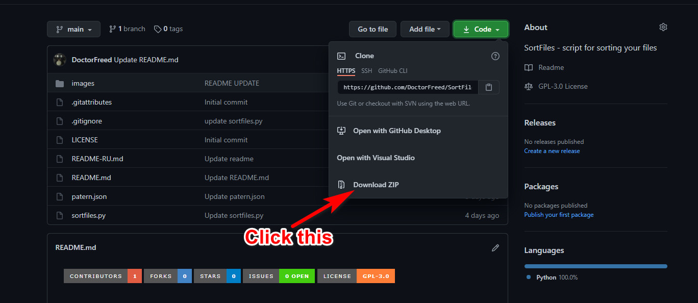

<!--
*** Thanks for checking out the Best-README-Template. If you have a suggestion
*** that would make this better, please fork the repo and create a pull request
*** or simply open an issue with the tag "enhancement".
*** Thanks again! Now go create something AMAZING! :D
***
***
***
*** To avoid retyping too much info. Do a search and replace for the following:
*** github_username, repo_name, twitter_handle, email, project_title, project_description
-->


<!-- PROJECT SHIELDS -->
<!--
*** I'm using markdown "reference style" links for readability.
*** Reference links are enclosed in brackets [ ] instead of parentheses ( ).
*** See the bottom of this document for the declaration of the reference variables
*** for contributors-url, forks-url, etc. This is an optional, concise syntax you may use.
*** https://www.markdownguide.org/basic-syntax/#reference-style-links
-->
[![Contributors][contributors-shield]][contributors-url]
[![Forks][forks-shield]][forks-url]
[![Stargazers][stars-shield]][stars-url]
[![Issues][issues-shield]][issues-url]
[![GPL License][license-shield]][license-url]


<!-- PROJECT LOGO -->
<br />
<p align="center">
  <a href="https://github.com/DoctorFreed/SortFiles">
    
  </a>

  <h3 align="center">SortFiles</h3>

  <p align="center">
     script for sorting your files
    <br />
    <a href="https://github.com/DoctorFreed/SortFiles"><strong>Explore the docs »</strong></a>
    <br />
    <br />
    <a href="https://github.com/DoctorFreed/SortFiles">View Demo</a>
    ·
    <a href="https://github.com/DoctorFreed/SortFiles/issues">Report Bug</a>
    ·
    <a href="https://github.com/DoctorFreed/SortFiles/issues">Request Feature</a>
  </p>
</p>


<!-- TABLE OF CONTENTS -->
<details open="open">
  <summary><h2 style="display: inline-block">Table of Contents</h2></summary>
  <ol>
    <li>
      <a href="#about-the-project">About The Project</a>
      <ul>
        <li><a href="#Required">Required</a></li>
      </ul>
    </li>
    <li>
      <a href="#getting-started">Getting Started</a>
      <ul>
        <li><a href="#prerequisites">Prerequisites</a></li>
        <li><a href="#installation">Installation</a></li>
      </ul>
    </li>
    <li><a href="#usage">Usage</a></li>
    <li><a href="#roadmap">Roadmap</a></li>
    <li><a href="#contributing">Contributing</a></li>
    <li><a href="#license">License</a></li>
    <li><a href="#contact">Contact</a></li>
    <li><a href="#acknowledgements">Acknowledgements</a></li>
  </ol>
</details>


<!-- ABOUT THE PROJECT -->
## About The Project

This project was created to reduce the garbage from files in folders, where I usually threw everything. Automatic sorting is of course a trivial task, personally I wanted this process to be as flexible and convenient as possible, so I decided that the sorting rules can be changed via a json file, in the future I will definitely add a GUI client for sorting, as well as a GUI for editing sorting rules in a json file. Even so, below you will find instructions on how to edit a json file manually using your text editor.


### Required

* [Python 3](https://www.python.org/downloads/)


<!-- GETTING STARTED -->
## Getting Started

To get a local copy up and running follow these simple steps.

### Prerequisites

You need to install Python 3:

* Windows 10

  1. Go to the official Python website, in the installation section at [this link](https://www.python.org/downloads/), download and install python 3.
        

* Ubuntu/Debian/Fedora, etc : python is already installed


### Installation

1. Clone the repo
   ```sh
   git clone https://github.com/DoctorFreed/SortFiles.git
   ```
   or
   
2. Running the script
   ```sh
   python sortfiles.py -h
   ```


<!-- USAGE EXAMPLES -->
## Usage
To get started, use the built-in documentation, for this you need to type in your console emulator:
```sh
python sortfiles.py -h

usage: sortfiles.py [-h] [-j JSON] [-u] [-d] [-l] folder

SortFiles - script for sorting your files https://github.com/DoctorFreed/SortFiles

positional arguments:
  folder                Specify the folder where the files will be sorted

optional arguments:
  -h, --help            show this help message and exit
  -j JSON, --json JSON  The path to the json file, if the argument is not specified, the template.json file will be used. If there is no file, the   
                        template that is already in the code will be used.
  -u, --unknown         by specifying this argument, unknown formats will be sorted into the "UNKNOWN" folder. By default, this sorting does not     
                        occur.
  -d, --debug           writes all the work of the script to the debug.log file
  -l, --log             writes to the info.log file about where the files were moved to
```
Now you can deal with each mode separately, it is important that each mod is optional and they can be combined together.

The default use of the script:
```sh
python sortfiles.py C:\MyFolder
```


_For more examples, please refer to the [Documentation](https://example.com)_


<!-- ROADMAP -->
## Roadmap

See the [open issues](https://github.com/github_username/repo_name/issues) for a list of proposed features (and known issues).


<!-- CONTRIBUTING -->
## Contributing

Contributions are what make the open source community such an amazing place to be learn, inspire, and create. Any contributions you make are **greatly appreciated**.

1. Fork the Project
2. Create your Feature Branch (`git checkout -b feature/AmazingFeature`)
3. Commit your Changes (`git commit -m 'Add some AmazingFeature'`)
4. Push to the Branch (`git push origin feature/AmazingFeature`)
5. Open a Pull Request


<!-- LICENSE -->
## License

Distributed under the MIT License. See `LICENSE` for more information.

<div>Icons made by <a href="https://www.freepik.com" title="Freepik">Freepik</a> from <a href="https://www.flaticon.com/" title="Flaticon">www.flaticon.com</a></div>

<!-- CONTACT -->
## Contact

Your Name - [@twitter_handle](https://twitter.com/twitter_handle) - email

Project Link: [https://github.com/github_username/repo_name](https://github.com/github_username/repo_name)


<!-- ACKNOWLEDGEMENTS -->
## Acknowledgements

* []()
* []()
* []()


<!-- MARKDOWN LINKS & IMAGES -->
<!-- https://www.markdownguide.org/basic-syntax/#reference-style-links -->
[contributors-shield]: https://img.shields.io/github/contributors/DoctorFreed/SortFiles.svg?style=for-the-badge
[contributors-url]: https://github.com/DoctorFreed/SortFiles/graphs/contributors
[forks-shield]: https://img.shields.io/github/forks/DoctorFreed/SortFiles.svg?style=for-the-badge
[forks-url]: https://github.com/DoctorFreed/SortFiles/network/members
[stars-shield]: https://img.shields.io/github/stars/DoctorFreed/SortFiles.svg?style=for-the-badge
[stars-url]: https://github.com/DoctorFreed/SortFiles/stargazers
[issues-shield]: https://img.shields.io/github/issues/DoctorFreed/SortFiles.svg?style=for-the-badge
[issues-url]: https://github.com/DoctorFreed/SortFiles/issues
[license-shield]: https://img.shields.io/github/license/DoctorFreed/SortFiles.svg?style=for-the-badge
[license-url]: https://github.com/DoctorFreed/repo/blob/master/LICENSE.txt
